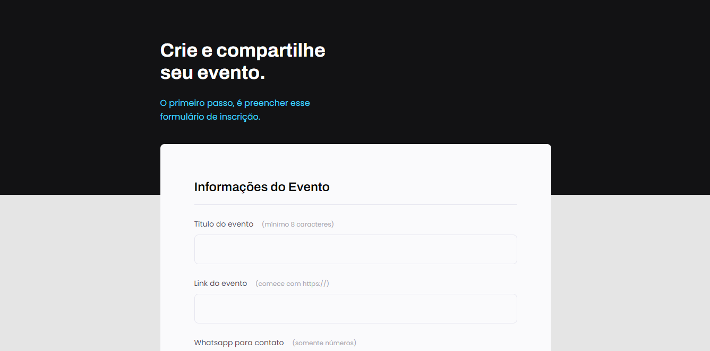

<h1 align="center"> Formulário para captura de dados através da web. </h1>

  <a href="#-tecnologias">Tecnologias</a>&nbsp;&nbsp;&nbsp;|&nbsp;&nbsp;&nbsp;
  <a href="#-projeto">Projeto</a>&nbsp;&nbsp;&nbsp;|&nbsp;&nbsp;&nbsp;
  <a href="#memo-licença">Licença</a>

  

 

  

## 🚀 Tecnologias

Esse projeto foi desenvolvido com as seguintes tecnologias:

- HTML
- CSS
- Git e Github
- Figma

## 💻 Projeto

Repositório de introdução ao tópico: formulários. Desenvolvido um formulário para captura de dados através da web.

  

- Para acessar ao projeto finalizado, [clique aqui](https://fernandoalvesrufino.github.io/pagina-de-formulario/).

 
## :memo: Licença

Esse projeto está sob a licença MIT.

---

by Fernando Rufino

> Projeto criado pela Rocketseat 